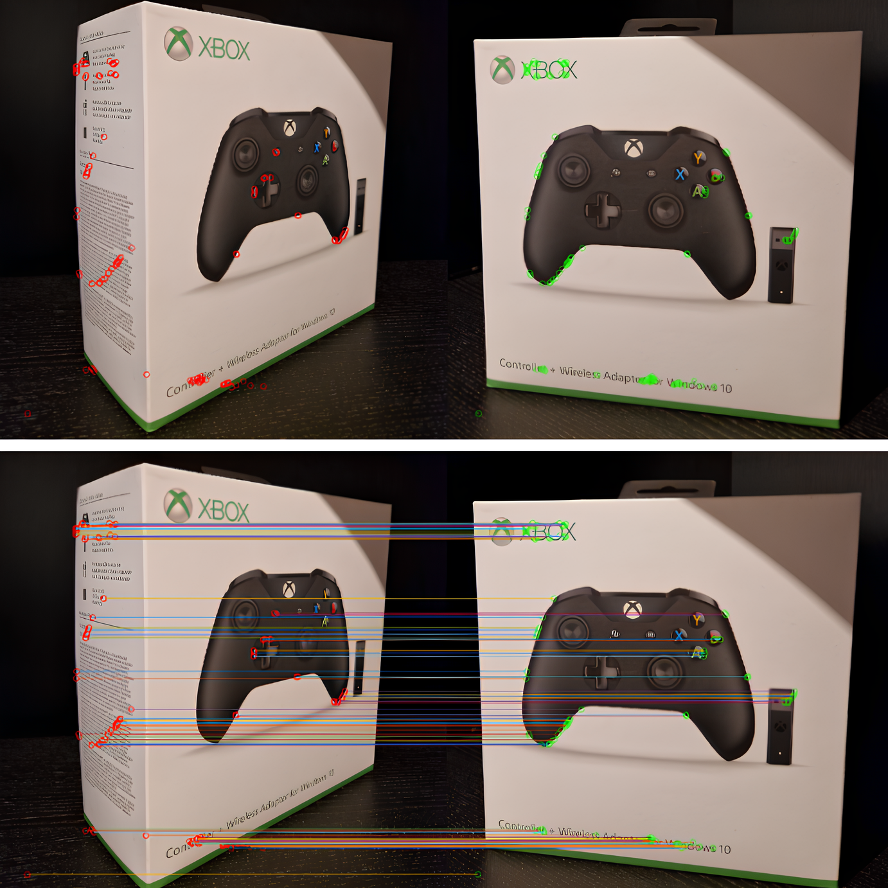

# Harris Find Points Between Images
This algorithm identifies corners in and make corrrelations between two images. 
## Steps
1. Smoothing the image using a **Gaussian filter** to reduce noise.
2. Computing the image **gradient** to capture intensity changes.
3. Calculating the **autocorrelation matrix** to analyze local gradient behavior.
4. Applying a **corner response** measure to identify potential corners based on the matrix elements.
5. Performing **non-maximum suppression** to eliminate weak corners and keep only the strongest ones.
6. Selecting **output corners** based on a chosen strategy 

## Result

